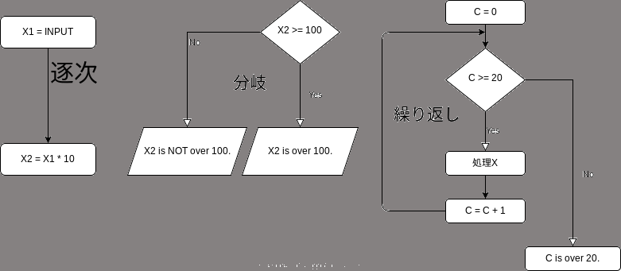
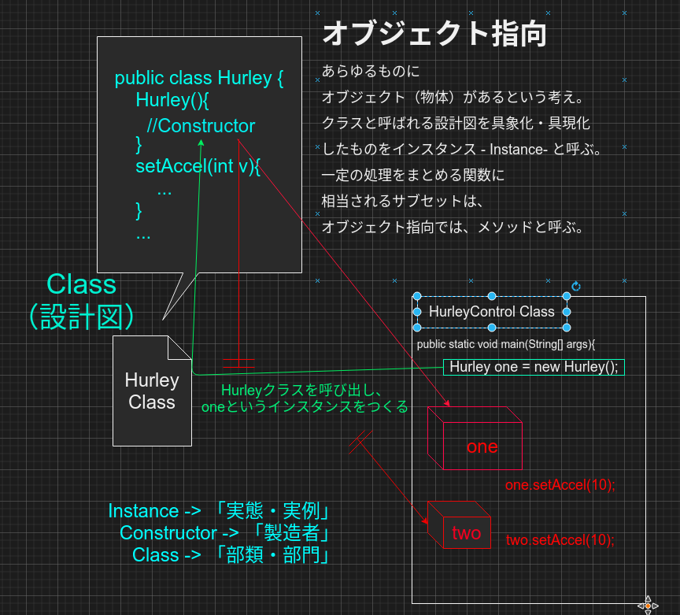

# プログラム構造の基本的考え方

プログラムは主に，
- 逐次
- 分岐
- 繰り返し
の3種類で構成されます．
順に説明します．

その後に，
-  関数型プログラミング
-  オブジェクト指向型プログラミング
について説明します

## 逐次・分岐・繰り返し



### 逐次

逐次実行は，順番に実行することを指します．
プログラムは基本的に逐次実行です．
いきなり処理が飛んだりすることはありません．
（昔は`goto`とよばれる構文を使い，いくつ目の処理に飛ぶ，というやり方をやっていましたが，プログラムの構造がメチャクチャになるのでプログラミングでは禁じ手とされています）
また基本的に「処理１」の実行が終了したあと「処理２」が開始されます．
いくつか処理を同時に走らせる（Running）したい場合は「スレッドプログラミング」という手法を行う必要があります．スレッドプログラミングでは，処理１と処理２を同時に走らせ，両方とも完了したら処理３を走らせるというような条件づけを定義していきます．

JavaやC言語などは逐次実行されますが，Javascriptは非同期的に実行されます．
非同期的とは，例えば幾つかの処理のブロックがあったときに，並列でブロックを走らせることです．


### 分岐

分岐は条件によって分岐されます．
このフローでは変数Xの入力に対し条件はTRUE（真）かFALSE（偽）を返します．


### 繰り返し

条件分岐から元のフローに戻ると，繰り返し文になります．
上記フローだと`do-while`（処理を実行してから判断する）文になります．
一般的な繰り返しは`while`（条件を満たしていれば繰り返す）文です．（下記）

## 関数型プログラミングとオブジェクト指向型プログラミング

### 関数型プログラミング

全てのプログラムを最初から最後まで書くと大変長くなります．
例えば「`a`~`b`までの間のランダムな数を５回出す処理」を100回するとします．
ランダムな数を抽出する処理を何回も書くのは可読性も欠けるし煩雑なこーどになります．
そこで出来たのが関数型プログラミングです．
以下はJavascriptのプログラムです．（Javaではないです）
```javascript
function random(min, max) {
    var index = 0;
    while(index<5){
        rand[index] = Math.floor(Math.random() * (max - min))   min; //ここ
        index  ;
    }
    return rand;
}
```
Javascriptでは，`function` （関数）を定義できます．
関数には名前（ここでは`random`）がついており，その後に**引数**が定義されます．
ここでの引数は`min`と`max`です．引数は呼び出す際に用いられます．
引数を利用して呼び出し，処理を行ったあと，結果を返す必要あります．結果を返す処理に当たるのが，`return rand;`です．ここでは変数`rand`を**返り値**として呼び出し元に返します．
例えば，上記のコードを最小値`1`最大値`10`で呼び出し，その結果を`value`に格納するとします．そうするとこんなかんじ．
```javascript
var value = random(1,10)
```
100回する場合は，関数の中身を100回書かずに呼び出す`random(min,max)`を100回書けば済みます．

#### Javaでの関数相当
Javaはオブジェクト指向型言語のため関数はありません．
Javaにおいて関数相当になるのが，**メソッド**です．
Javaにおいて最も知られるメソッドは`main`です．
```java
/*
公開された 静的な 返り値のない メインメソッド
 publicはアクセス可能な範囲（このほかにprivateやprotectedなど）
 static をつけるとクラスメソッドと呼ばれる種類になります．つけないとインスタンスメソッドと呼ばれるものになります．これはオブジェクト指向の考え方（後述）で説明します
 void は返り値がないという意味です．文字列を返す場合は`String`を指定する必要があります．数字なども同様です．
 mainがメソッド名です．
 引数は`String[]`型の変数`args`です．
*/
public static void main(String[] args){
```
```java
public class Hoge{
        // 1. mainメソッドに入る．
        // 引数は文字列配列（複数の文字列）を組み込める
        public static void main(String[] args){
        int a = 1;
        // 2. 文字列配列（複数の文字列）の1番目を単一の文字列に格納する
        String b = args[0];
        // 3. 呼び出す．
        // 6. 返された数字を`c`に入れる．
        int c = sub(b,a);
        // 7. `c`を表示する
        System.out.println(c);
    }
    static int sub(String beta,int alpha){
        // 4. 呼び出される．`b`は`beta`として扱われる．文字列`beta`を数字データに変える
        int tmp = Integer.parseInt(beta);
        // 5. 足したデータを返す（リターンする）
        return alpha   beta;
    }
}
```
`main`がプログラムを実行する時に最初に実行される特別なメソッドです．
`main`の引数`args`はプログラムが実行される際に用いられます．
下記に引数アリでの実行とナシでの実行を見せます．
```bash
# なしでの実行
java Hoge
# 1個つける
java Hoge 10
# 2個
java Hoge 10 21
```

プログラムでは，(2.)において1番目のデータを文字列`b`に入れています．
上記では，`sub`というメソッドを定義し，数字だけど文字列データになっている`b` と数字データの`a`を引数として呼び出しています．
`sub`で，文字列を数字のデータに変え(4.)，足したデータを返しています（5.）
Javaではデータを返すときはメソッドの定義の際にそのデータの形を明記しておく必要があります（ここでは`int`）

### オブジェクト指向の考え方



関数の考え方にも欠点があります．
例えば，ハーレーダビッドソンのバイクに関するプログラムがあったとします．
バイクには，アクセルの操作・ブレーキの操作など様々な関数が想定されます．
同じバイクが100台あったとします。
関数型の場合は、100個分の関数を書く必要が出てきます。Javascriptだとこんな感じ。
```
function Hurley001_accel(footing){~}
function Hurley002_accel(footing){~}
...
function Hurley099_accel(footing){~}
function Hurley100_accel(footing){~}
```
オブジェクト指向ではこれを解決することが出来ます．
Javaでこれを書き直すとこんなかんじになります．

-  Hurley.java
```java
public class Hurley {
    // クラス定数
    final static String model = "XL883H";

    // クラス変数
    static int num_of_units;
    // インスタンス変数
    int speed;
    boolean light = false;

    // コンストラクタ
    Hurley(){
        num_of_units++;
    }
    //コンストラクタ（初期化時にスピード調整）
    Hurley(int speed_src){
        num_of_units++;
        this.speed = speed_src;
    }

    // インスタンスメソッド
    //----------------------------------------
    // スピード調整
    public void setSpeed(int speed){
        this.speed = speed;
    }
    public int getSpeed(){
        // ローカル変数のない場合は this がなくても動作する
        // But...?
        return this.speed;
    }
    //----------------------------------------
    // ライトの切り替え
    public void setLight(boolean light){
        this.light = light;
    }
    public boolean getLight(){
        return this.light;
    }
    //========================================
    // クラスメソッド
    //----------------------------------------
    // Hurleyの台数
    public static int getUnits(){
        return this.num_of_units;
    }
    public static String getModel(){
        return this.model;
    }
}
```

- HurleyControl.java
```java
public class HurleyControl {
    public static void main(String[] args){
        // １台目作成
        Hurley one = new Hurley();
        // 2台目作成
        Hurley two = new Hurley(20);

        // 1台目のアクセルを10踏む
        one.setSpeed(10);
        // 2台目のアクセル取得
        System.out.println(two.getSpeed());
        // Hurleyクラス変数をgetUnits()を使って取得する
        System.out.println(Hurley.getUnits());
    }
}
```

#### 注意

- ふたつのファイルは同じディレクトリ内に作成すること．


