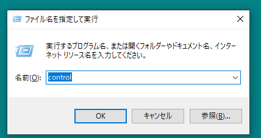
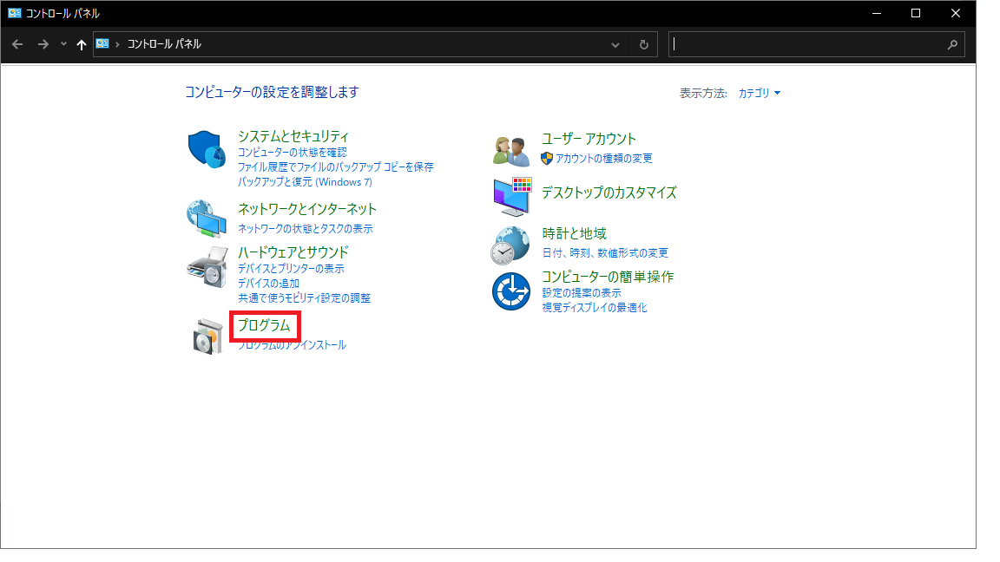
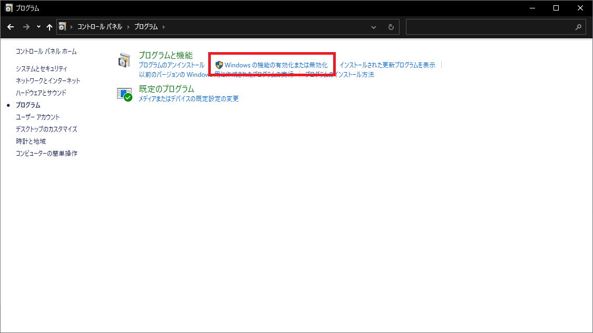
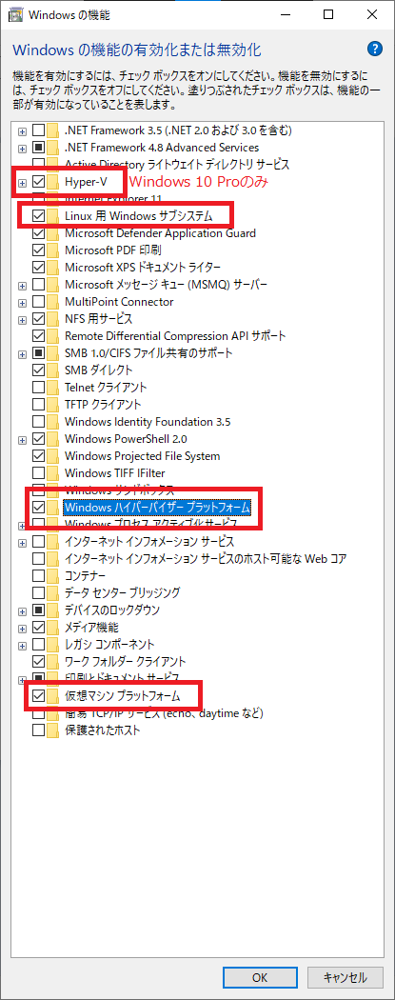
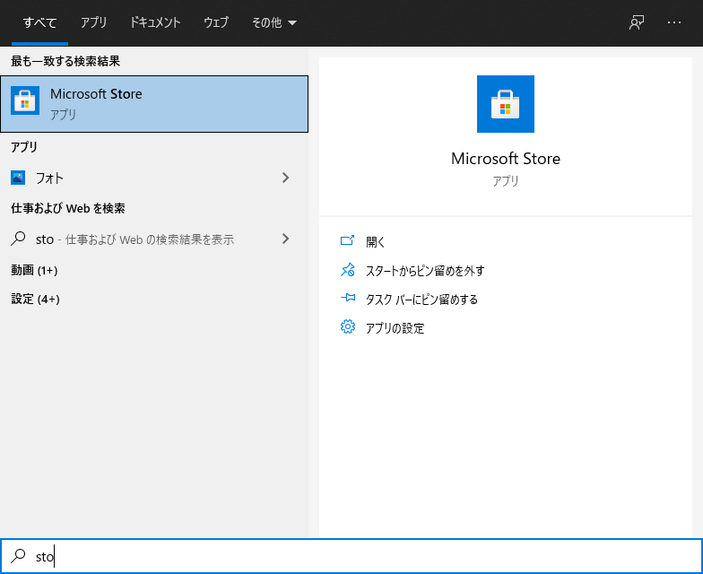

Title: WSLを有効化する方法
Date: 2021-04-29
Category: Linux
Tags: WSL

事前にWindowsUpdateなどを行い最新の状態にしてください。

1. `WIN+R`を押して，「ファイル名を指定して実行」を開く．
2. コントロールパネルである「control」と入力してOKする．
3. コントロールから，プログラム，「Windowsの機能の有効かまたは無効化」を開く．
4. 下記の項目にチェック付けて有効化させる．

- Hyper-V(Windows 10 Proのみ)
- Linux用Windowsサブシステム（WSLのこと）
- Windowsハイパーバイザープラットフォーム（VirtualBoxとの併用で必要となります）
- 仮想マシンプラットフォーム（よりコンテナ化された仮想マシンプラットフォームが使える）

再起動を求められるので，再起動します．

再起動したら，Microsoft Storeを開きます．

検索ボックスに「WSL」と入れて，検索します．そのあと「Ubuntu 18.04 LTS」をダウンロード・インストールします．

__Ubuntuは，バージョン番号ナシの「Ubuntu」とより新しい「Ubuntu 20.04 LTS」などがありますので間違えないように__

